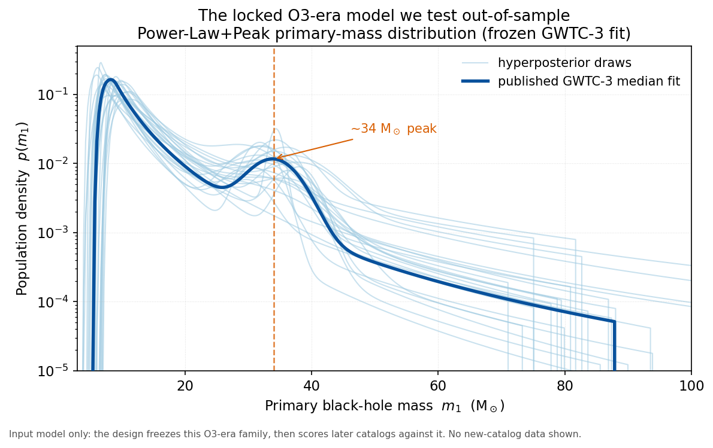

# Did We See It Coming?

**A 2021 model of the black-hole population, frozen and tested against the
gravitational-wave catalogs that arrived years later: does it actually predict
the future, or just describe the past it was fit to?**

## The question

When astronomers infer the population of merging black holes from
gravitational-wave detections, they *fit* a model to whatever catalog they have
and then show that it describes that catalog well. That is circular by
construction: a model is almost always good at explaining the data it was tuned
on. The harder, more honest question is **prediction**: take a model fit only to
the black holes seen through early 2020, lock it, and ask whether it correctly
forecasts the black holes discovered in the *next* observing runs, events it
never saw.

This project does exactly that. It freezes the LIGO/Virgo/KAGRA GWTC-3
population fit (O3 data, released 2021), forward-models what later observing runs
*should* detect, and scores the real later catalogs against that frozen
prediction. A clean "the flagship model does not extrapolate" is itself a
publishable result, provided it survives a calibration check against the
randomness of small catalogs.



*The frozen O3-era model we test out-of-sample. The "Power-Law+Peak" primary-mass
distribution defined by the 2021 GWTC-3 fit: a power-law falloff toward high mass,
a smooth turn-on near 5 M_sun, and a distinctive bump around 34 M_sun. The deep
blue curve is the published median fit; the light curves are draws from the fit's
uncertainty. This is the design's **input** model. The catalogs it is tested
against are held out and never plotted.*

## How it works

The whole thing hinges on freezing one model and refusing to touch it again. I load
the GWTC-3 Power-Law+Peak fit (mass, spin, and redshift) exactly as it was released on
Zenodo (record 5655785), with no refitting of any kind. From that frozen fit I
forward-model, through the public sensitivity injections, what the *detectable* black-hole
population of the later observing runs should look like. Then I score the real catalogs
that actually arrived: O4a / GWTC-4.0 is the primary epoch, and O4b / GWTC-5.0 is a
straight replication on the same frozen fit, so one 2021 model gets two independent
verdicts.

The scoring uses two calibrated checks: a posterior-PIT statistic for the shape of the
distribution, and a Poisson test for how many events show up, each with a falsification
threshold fixed in advance. Before any of that runs on real data, there's a gate: the
pipeline has to demonstrate on mock catalogs that it doesn't shout "mismatch" simply
because a real catalog is small and noisy.

## What makes it rigorous

The design is pre-registered and locked. The two-epoch structure, the test statistics,
the falsification thresholds, and the exact event lists were all committed to
[`PRE_REGISTRATION.md`](PRE_REGISTRATION.md) before a single predictive score was
computed, and none has been computed yet. That ordering matters here more than usual,
because a null is a perfectly good outcome: "the field's flagship model does not
extrapolate" and "it holds up fine" are both clean, reportable answers, and the analysis
is not rooting for either one.

The data handling is blind by construction. Catalog files get mechanically reduced to
fixed column subsets with structure-only logging, so no summary of any held-out posterior
value is ever looked at before unblinding. And every input is an open-access LVK data
release, pinned by Zenodo record id and checksum, so anyone can rebuild the exact same
inputs.

## Status

- **Pre-registration LOCKED** (two-epoch design, statistics, thresholds, and
  byte-pinned event lists are binding).
- **Scoring pipeline built and validated on synthetic data.** Frozen-model loader
  (`src/population_model.py`), forward model with the locked selection recipe
  (`src/predict.py`), and locked scoring rules behind a runtime lock guard
  (`src/score.py`); end-to-end tests on fabricated data pass.
- **Real scoring is queued**, in the locked order: finish data acquisition →
  forward model → blocking calibration gate → unblind Epoch 1 → unblind Epoch 2.
  The real entrypoint refuses to run until the calibration report is committed.

## Reproduce / links

```bash
# 1. set up the pinned environment (Python 3.14; see requirements.txt)
python3 -m venv .venv
.venv/bin/pip install -r requirements.txt

# 2. regenerate the figure above (uses the project's own mass-model library;
#    CPU-only, deterministic under the locked seed, runs in seconds)
.venv/bin/python -m src.figures.plot_frozen_model

# 3. run the synthetic-data pipeline tests (no real catalog data, no model run)
.venv/bin/python -m pytest -q
```

Fetching the real input data (GB-scale, not committed) is documented separately in
[`data/README.md`](data/README.md); the predictive scoring stage is gated and does not
run until the mock-calibration report is committed (see
[`PRE_REGISTRATION.md`](PRE_REGISTRATION.md) §7-§8).

- [`PRE_REGISTRATION.md`](PRE_REGISTRATION.md): the locked, binding analysis plan.
- [`docs/related_work.md`](docs/related_work.md): where this sits in the literature
  and the gap it fills.
- [`docs/paper_outline.md`](docs/paper_outline.md): preprint skeleton (astro-ph.HE);
  Results are placeholders until unblinding.
- [`data/README.md`](data/README.md): every data product with Zenodo record ids,
  checksums, and fetch commands. Raw data are never committed.

Pinned toolchain (`requirements.txt`), fixed seed (`20260610`), laptop-scale CPU
only. License: code MIT (planned); data are open-access Zenodo records (CC-BY-4.0).
